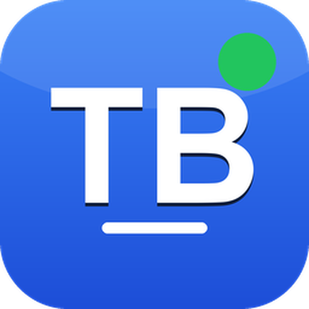
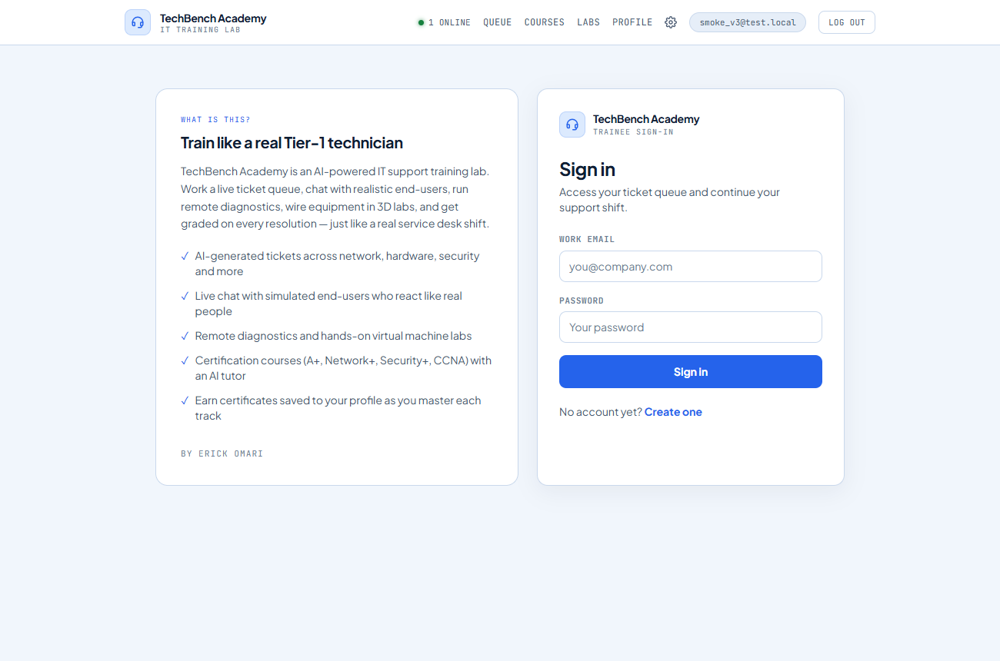
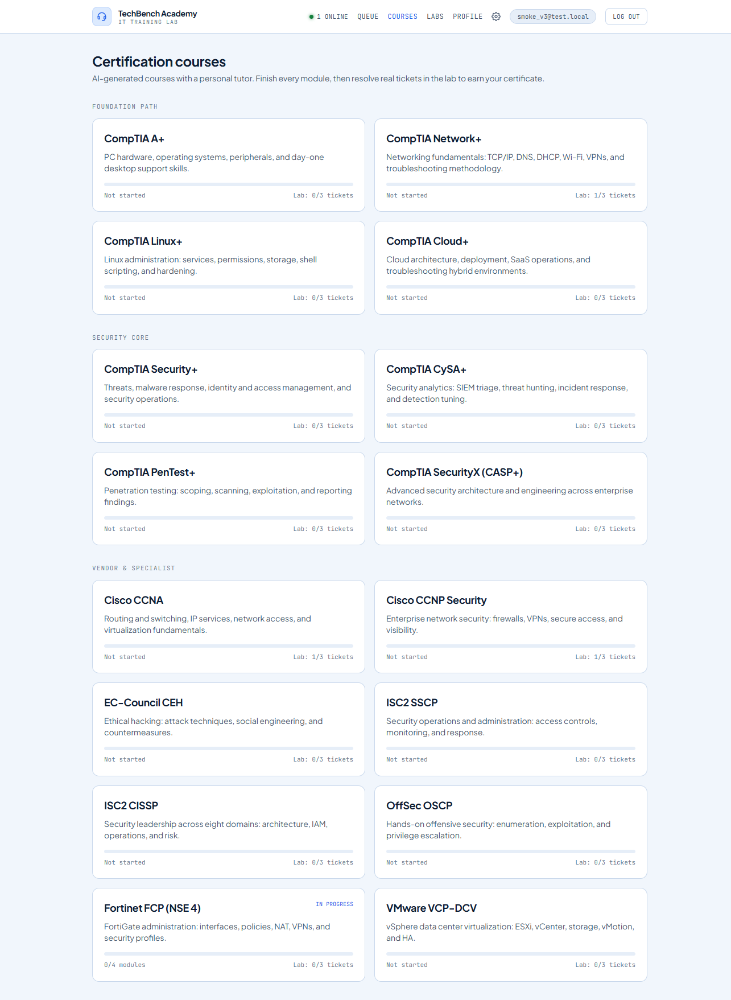
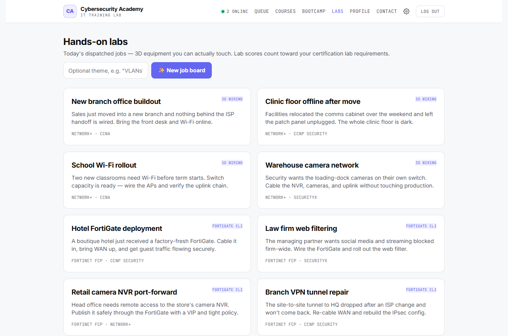
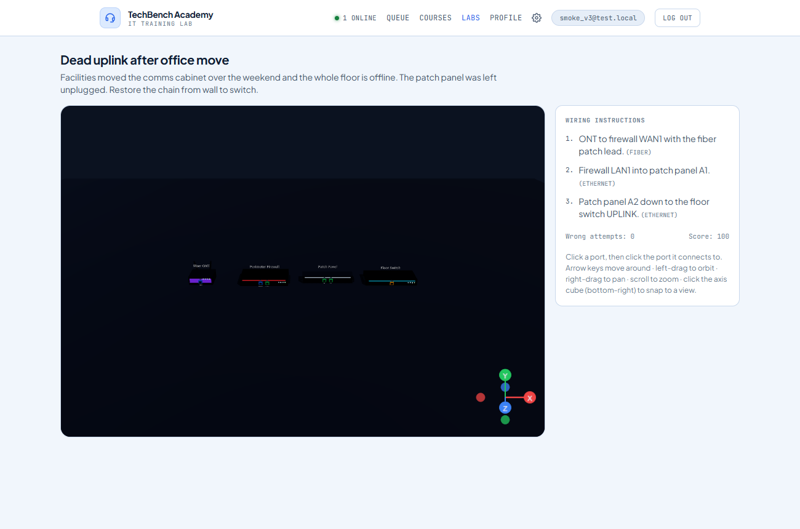
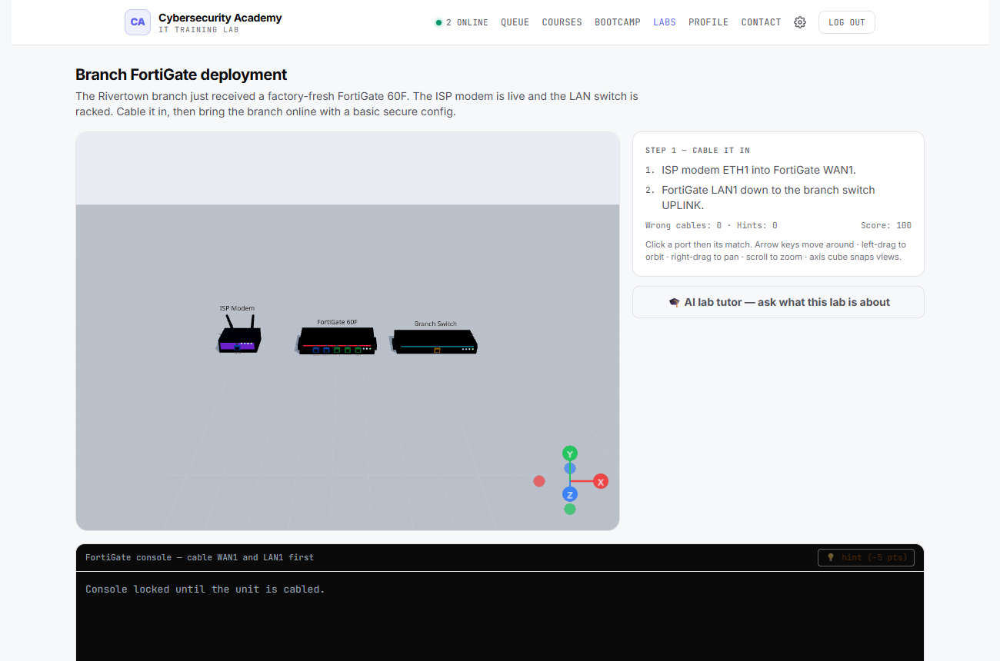
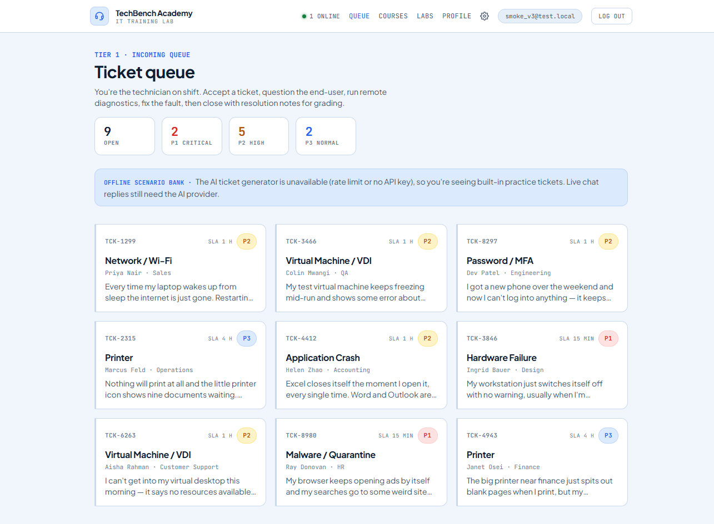
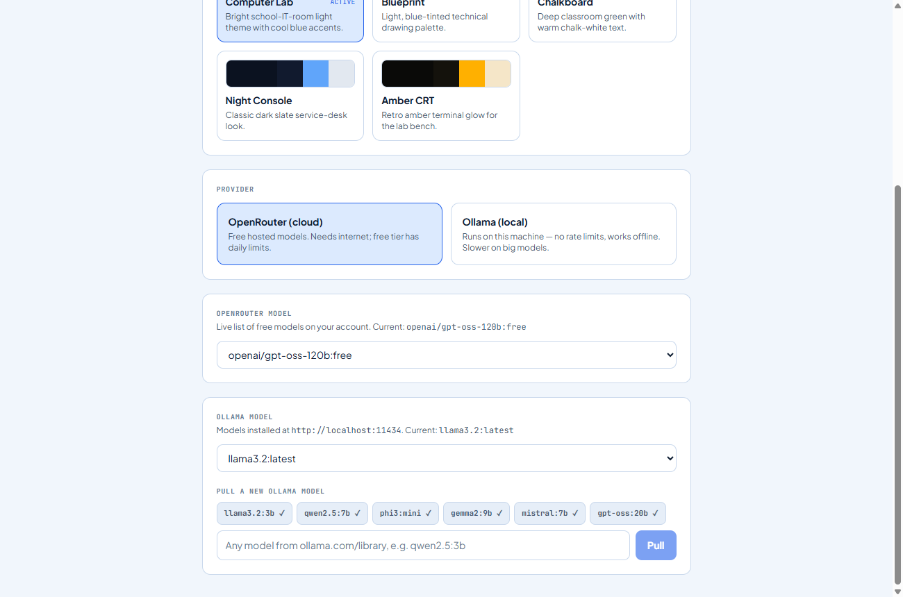
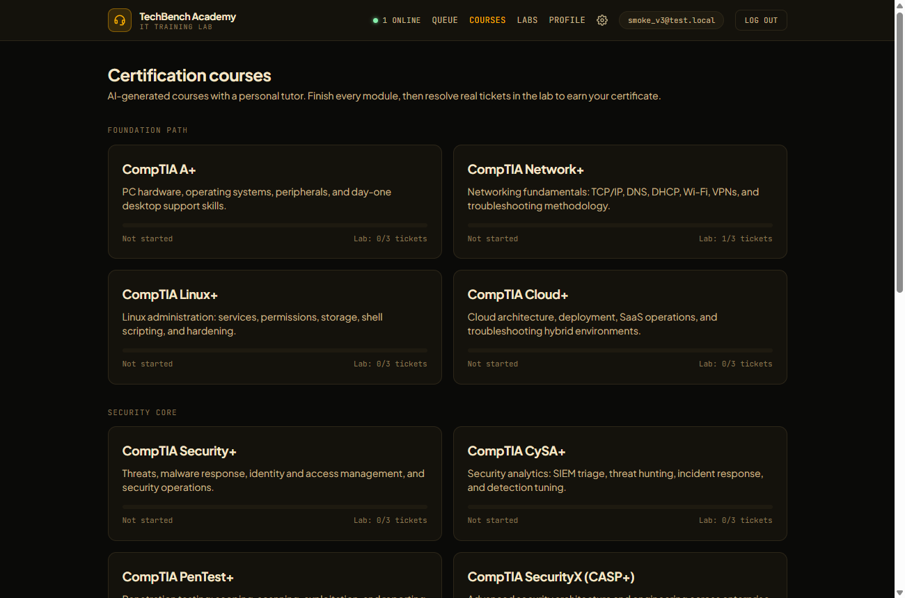

<div align="center">



# TechBench Academy

### Your training lab for real IT support

An AI-powered IT help-desk simulator where you play a Tier-1 technician: work a live
ticket queue, chat with realistic end-users, run remote diagnostics, wire equipment in
**interactive 3D labs**, take **16 certification courses** with an AI tutor, and earn
certificates — all graded against a rubric.


</div>

---

## What is this?

TechBench Academy turns "learning IT support" into an actual shift on the desk. Instead of
reading about DNS or a dead switch uplink, you **do the job**: an AI role-plays the frustrated
end-user, you ask questions, run `/run ipconfig /all`-style diagnostics against a simulated
machine, and close the ticket with resolution notes that get graded 0–100 on a real support
rubric (clarifying questions, logical steps, correct root-cause fix, verification, tone, and
documentation).

On top of the ticket queue it adds a full **learning path** — 16 stacked cybersecurity
certifications, hands-on **3D equipment labs**, simulated **virtual machines**, and printable
**certificates**.

<div align="center">
  
</div>

---

## Highlights

| | |
|---|---|
| 🎫 **Live ticket queue** | AI-generated tickets across 14 categories (network, hardware, malware, phishing, SIEM, firewall, Linux, cloud, IAM, pentest findings…). Each opens a real-time chat against an LLM playing the end-user. |
| 🩺 **Remote diagnostics** | Messages starting with `/run <command>` are treated as remote commands; the end-user "machine" answers with raw terminal-style output. |
| 🎓 **16 certification courses** | A+, Network+, Linux+, Cloud+, Security+, CySA+, PenTest+, SecurityX, CCNA, CCNP Security, CEH, SSCP, CISSP, OSCP, Fortinet FCP, VMware VCP — each AI-generated once, with lessons, quizzes, and a per-lesson **AI tutor**. |
| 🧩 **Practice tickets from courses** | Generate real tickets built from the exact modules you just studied — solving them counts toward the track's lab requirement. |
| 🧷 **3D wiring lab** | Cable a branch office in Three.js: modem → router → switch → APs. Correct links animate a cable and blink the port LEDs; wrong pairs flash red. Watch packets flow when it's all up. |
| 🔥 **3D FortiGate lab** | Rack and cable a FortiGate 60F, then configure it for real over a simulated **FortiOS CLI** — interfaces, policies, NAT, web filtering. |
| 💻 **Simulated VM labs** | A full fake machine (lock screen + terminal/settings/files) with a hidden fault you fix through real commands. |
| 🏆 **Auto-issued certificates** | Pass every module ≥ 80% and resolve 3 tickets ≥ 70 in the track's categories → a printable certificate lands on your profile. |
| 🎨 **5 switchable themes** | Computer Lab (light), Blueprint, Chalkboard, Night Console, Amber CRT — applied instantly, saved per browser. |

---

## Certification courses

Sixteen tracks organised into three tiers — Foundation, Security Core, and Vendor & Specialist.
Courses are AI-generated once per user and cached, so they don't burn API quota on every visit.

<div align="center">
  
</div>

---

## Hands-on 3D labs

Real equipment you can actually touch — built with **Three.js / React Three Fiber**, loaded only
on the lab routes so the engine never bloats the rest of the app. Navigate with the mouse, the
**arrow keys**, or the on-screen orientation cube.

<div align="center">
  
</div>

### Network wiring lab

Follow the wiring order for a realistic job (branch buildout, dead uplink, AP rollout). Devices
are modelled as real gear — rackmount chassis with rack ears and RJ45 jack banks, ceiling-AP
pucks, SOHO modems, PC towers. Correct connections animate a cable and light the LEDs; the run is
scored `max(60, 100 − 10 × wrong)`.

<div align="center">
  
</div>

### FortiGate firewall lab

Cable the unit in 3D to unlock the console, then drive a simulated FortiOS CLI to bring the branch
online. Tasks tick off automatically as your config actually completes them.

<div align="center">
  
</div>

---

## Ticket queue

Triage a live queue with P1–P3 priorities and SLA targets. When the AI provider is rate-limited,
the queue falls back to hand-written scenarios so the app always works.

<div align="center">
  
</div>

---

## Themes

Five full themes, switchable from **Settings → Appearance** and saved to your browser.

<div align="center">
  
  <br/><br/>
  
  
</div>

---

## Tech stack

- **Framework:** Next.js 14 (App Router) · TypeScript · React 18
- **3D:** Three.js · @react-three/fiber 8 · @react-three/drei 9
- **Auth & data:** email/password (bcryptjs) + JWT session cookie · libSQL (`@libsql/client`) — local SQLite file in dev, Turso in production
- **AI:** OpenRouter-compatible endpoint (free models) with model fallback + retry, or local **Ollama**
- **Styling:** Tailwind CSS + CSS-variable design tokens (5 themes) · Plus Jakarta Sans + JetBrains Mono
- **Testing:** Jest + ts-jest (pure logic modules are unit-tested; R3F is never imported in tests)

---

## Getting started

```bash
git clone https://github.com/pitchiluxe/techbench-academy.git
cd techbench-academy
npm install
```

Create `.env.local`:

```bash
# Session signing secret (any long random string)
AUTH_SECRET=change-me-to-a-long-random-string

# OpenRouter-compatible AI endpoint
ANTHROPIC_BASE_URL=https://openrouter.ai/api
ANTHROPIC_AUTH_TOKEN=your-openrouter-key
ANTHROPIC_MODEL=openai/gpt-oss-120b:free
# Optional comma list (max 3 total) for provider-side fallback routing
ANTHROPIC_FALLBACK_MODELS=meta-llama/llama-3.3-70b-instruct:free
```

Run it:

```bash
npm run dev     # dev server on http://localhost:3000
npm run build   # production build
npm test        # Jest suite
```

> **No API key?** The labs and ticket queue ship with built-in fallback scenarios, so you can
> explore the 3D labs and queue offline. Courses, chat replies, and grading need a model — or point
> the app at a local **Ollama** server in Settings for unlimited, offline generation.

---

## Architecture

All correctness logic lives in pure, unit-tested `lib/` modules; API routes are thin wrappers.

- **`lib/scenarios.ts`** — every LLM prompt (queue generation, end-user roleplay, grading) + the 14 ticket categories.
- **`lib/courses.ts` / `lib/certification.ts`** — 16-track catalogue, quiz grading (answer keys never leave the server), and the auto-certificate rule.
- **`lib/wiringLab.ts` / `lib/fortigateLab.ts`** — 3D-lab scenario models, connection validation, scoring, and `[TASK_DONE]`/`[LAB_COMPLETE]` markers, each with static fallbacks.
- **`lib/openrouter.ts`** — provider call with retry/back-off, model-fallback routing, and human-readable error messages (rate-limit, auth, outage).
- **`lib/themes.ts`** — theme registry + FOUC-free init; tokens live as `:root[data-theme]` sets in `app/globals.css`.
- **`components/lab/WiringScene.tsx`** — the Three.js scene (realistic devices, animated cables, packet flow), shared by both 3D labs.

See [CLAUDE.md](CLAUDE.md) for the full architecture notes.

---

## Deploying to Vercel

The app runs on Vercel out of the box. Data lives in **libSQL** via `@libsql/client`, which uses a
local SQLite file in development and **[Turso](https://turso.tech)** (or any libSQL server) in
production — no ephemeral-filesystem problems.

1. Create a Turso database and grab its URL + auth token (`turso db create techbench && turso db show --url techbench && turso db tokens create techbench`).
2. Import the repo at [vercel.com/new](https://vercel.com/new).
3. Set the environment variables above **plus**:

   ```bash
   TURSO_DATABASE_URL=libsql://your-db.turso.io
   TURSO_AUTH_TOKEN=your-turso-token
   NEXT_PUBLIC_SITE_URL=https://your-domain.vercel.app   # for canonical URLs & OG tags
   ```

4. Deploy. The schema is created automatically on first request.

Locally, no Turso is needed — the app defaults to `file:./data/app.db`.

---

## License

MIT — see [LICENSE](LICENSE).

<div align="center">
<sub>Built by <a href="https://github.com/pitchiluxe">Erick Omari</a> · powered by Next.js, Three.js, and open AI models.</sub>
</div>
